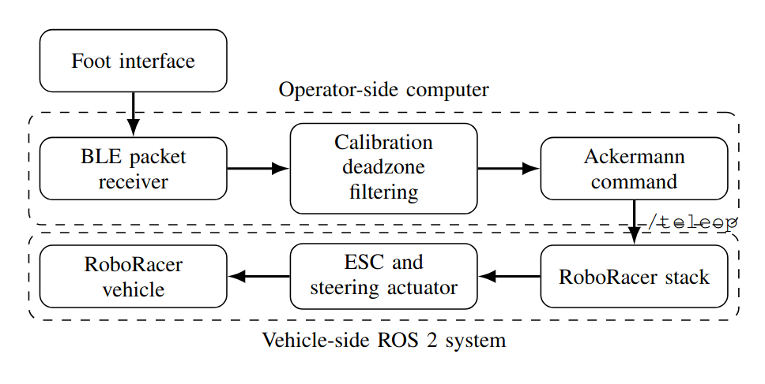
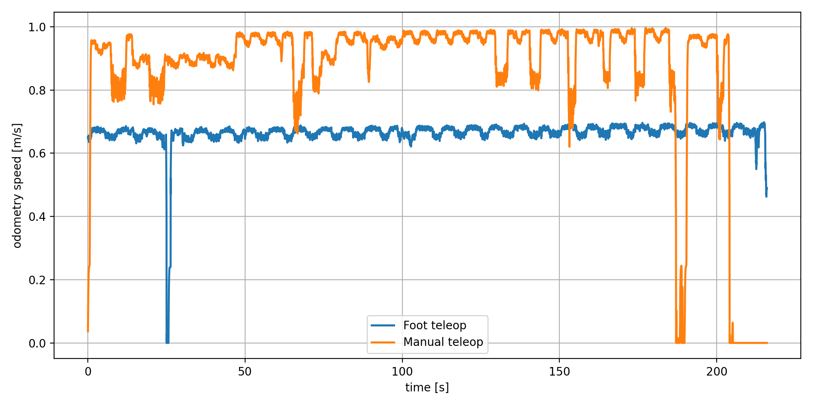
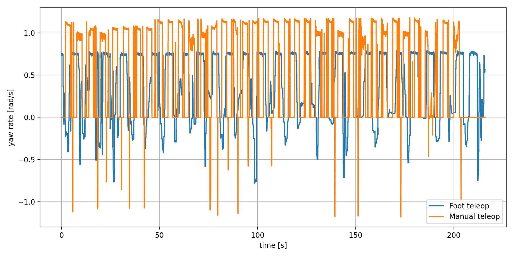
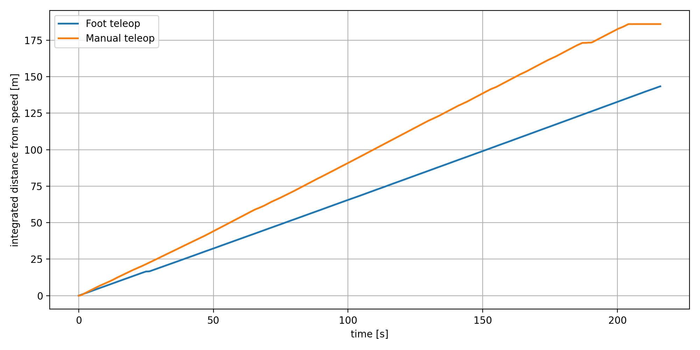
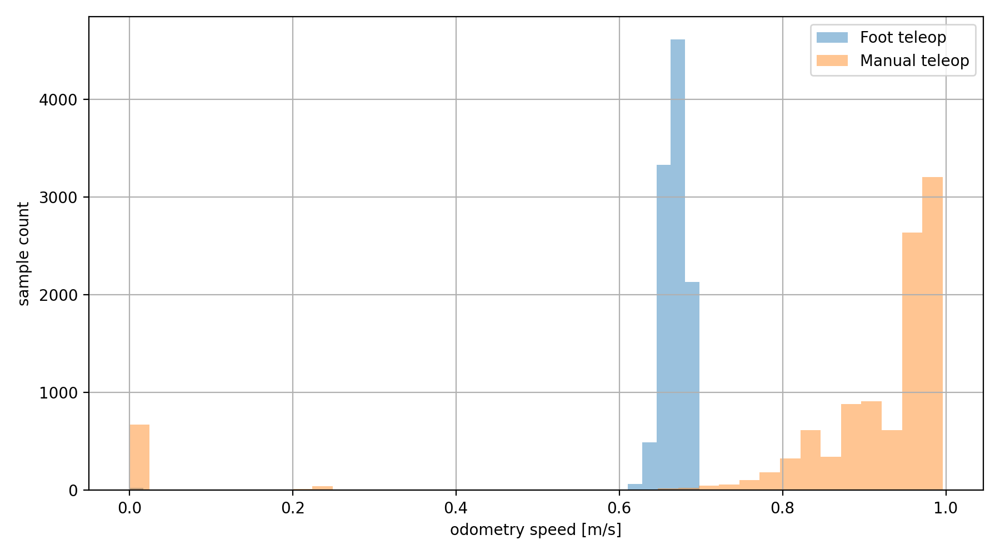
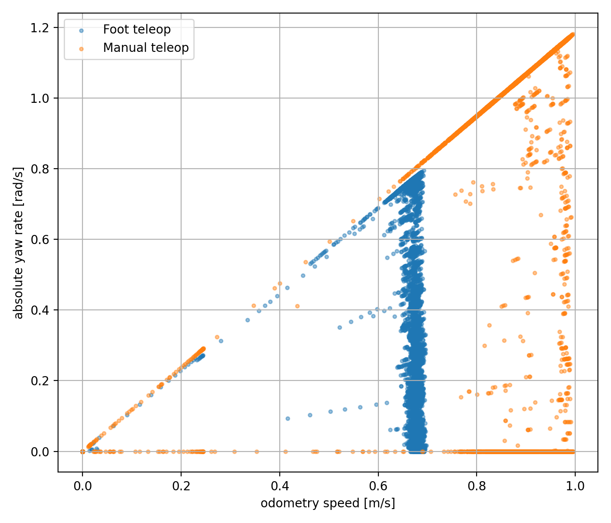

## Abstract

This paper presents a wearable foot-based teleoperation interface for a small-scale unmanned ground vehicle. The proposed interface uses a Bluetooth Low Energy inertial sensor attached to the operator's foot and converts foot orientation into Ackermann steering and speed commands in a ROS 2-based vehicle control architecture. The method is evaluated on a RoboRacer-type indoor test vehicle and compared with conventional manual joystick teleoperation. Experimental results show that the foot controller enabled continuous vehicle operation over the complete test run, with a more conservative speed profile than manual control. The manual joystick produced a higher average speed and longer travelled distance, while the foot interface resulted in lower maximum yaw rate and a narrower speed distribution. The results indicate that foot-based teleoperation is feasible for ground vehicle control, but further tuning of longitudinal command generation and steering sensitivity is required to improve driving efficiency and reduce operator workload.

---

## Links

- 📄 **Paper**: coming soon
- 💻 **Code**: coming soon
- 📊 **Rosbags / Data**: [Assets/Data](Assets/Data)

---

## Method

The proposed system uses a foot-mounted BLE inertial sensor as a wearable teleoperation interface. The measured foot orientation is decoded on the operator-side computer, calibrated around a neutral pose, passed through a deadzone and low-pass filter, and converted into Ackermann speed and steering commands. The generated commands are published to the RoboRacer control stack through the same teleoperation input topic used by the reference manual controller.

 

  

     
    <em>System architecture of the proposed foot-based teleoperation interface.</em>
  

 

---

## Test Run

The following recordings show the RoboRacer vehicle's steering and throttle functionalities with the proposed foot-based teleoperation interface.

 

  

     
    <em>Example test run using the foot-based teleoperation interface.</em>
  

  

     
    <em>Steering functionality test using foot-based commands.</em>
  

  

     
    <em>Throttle functionality test using foot-based commands.</em>
  

<!-- If you prefer MP4 instead of GIF, use this block and remove the GIF block above:

  <video autoplay loop muted playsinline controls style="width:80%; max-width:800px;" src="Assets/Figures/foot_test_run.mp4"></video>

-->

---

## Results

 

## Results

The recorded runs were trimmed to equal length before comparison. The evaluation interval was approximately 216 seconds for both control methods. The foot controller completed the full run and generated continuous vehicle commands throughout the experiment. Compared with manual joystick control, it produced a more conservative speed profile and lower peak yaw-rate values.

 

<table style="border-collapse: collapse; text-align: center;">
  <thead>
    <tr>
      <th style="padding: 6px 12px;">Metric</th>
      <th style="padding: 6px 12px;">Foot control</th>
      <th style="padding: 6px 12px;">Manual control</th>
    </tr>
  </thead>
  <tbody>
    <tr>
      <td style="padding: 6px 12px; text-align:left;">Duration [s]</td>
      <td style="padding: 6px 12px;">215.93</td>
      <td style="padding: 6px 12px;">215.96</td>
    </tr>
    <tr>
      <td style="padding: 6px 12px; text-align:left;">Integrated distance [m]</td>
      <td style="padding: 6px 12px;">143.37</td>
      <td style="padding: 6px 12px;">186.02</td>
    </tr>
    <tr>
      <td style="padding: 6px 12px; text-align:left;">Mean speed [m/s]</td>
      <td style="padding: 6px 12px;">0.664</td>
      <td style="padding: 6px 12px;">0.861</td>
    </tr>
    <tr>
      <td style="padding: 6px 12px; text-align:left;">Maximum speed [m/s]</td>
      <td style="padding: 6px 12px;">0.698</td>
      <td style="padding: 6px 12px;">0.996</td>
    </tr>
    <tr>
      <td style="padding: 6px 12px; text-align:left;">Mean absolute yaw rate [rad/s]</td>
      <td style="padding: 6px 12px;">0.459</td>
      <td style="padding: 6px 12px;">0.485</td>
    </tr>
    <tr>
      <td style="padding: 6px 12px; text-align:left;">Maximum absolute yaw rate [rad/s]</td>
      <td style="padding: 6px 12px;">0.795</td>
      <td style="padding: 6px 12px;">1.181</td>
    </tr>
  </tbody>
</table>

 

  

     
    <em>Odometry speed comparison over equal-length runs.</em>
  

  

     
    <em>Yaw-rate comparison over equal-length runs.</em>
  

 

  

     
    <em>Integrated distance calculated from odometry speed.</em>
  

  

     
    <em>Speed distribution over equal-length runs.</em>
  

 

  

     
    <em>Speed versus absolute yaw rate for foot-based and manual control.</em>
  

---